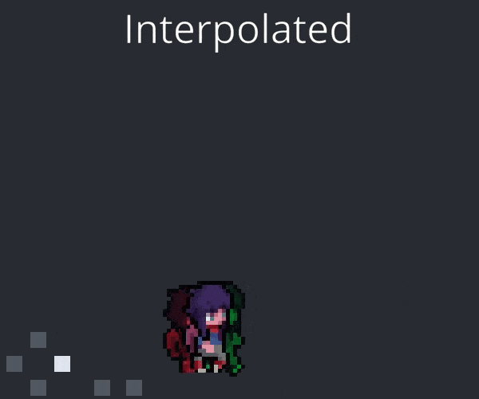

# Fixed Timestep Demo

This is a demo to show a number of different ways to render a game with a fixed-timestep simulation.

You can read [my article](https://jakubtomsu.github.io/posts/fixed_timestep_without_interpolation) to learn more about fixed timestep simulations in general.

## Overview
This is a short overview of the most important methods in the demo:
- Interpolation: Always smooth. Needs a way to interpolate two game states, this can be a pain to implement. Always lags one tick behind - this means worse latency, especially with low TPS.
- Render Tick: No added latency, matches real time "perfectly". Very easy to implement, especially if your game state and tick is set up in a nice way. However the single render tick can get inaccurate with low TPS because each update step is linear.
- Accumulated Render Tick: More accurate in low TPS simulations, however because of the input frequency is so different between the predicted and the fixed ticks it can get out of sync.

## Controls
- Use WASD to move the player, space to dash and M to shoot a bullet.
- Use left/right arrow keys to change the simulation mode
- Use up/down arrow keys to change the TPS

# Credit
- [Adventurer character art](https://sscary.itch.io/the-adventurer-male)
- [Bullet art](https://bdragon1727.itch.io/free-effect-and-bullet-16x16)
